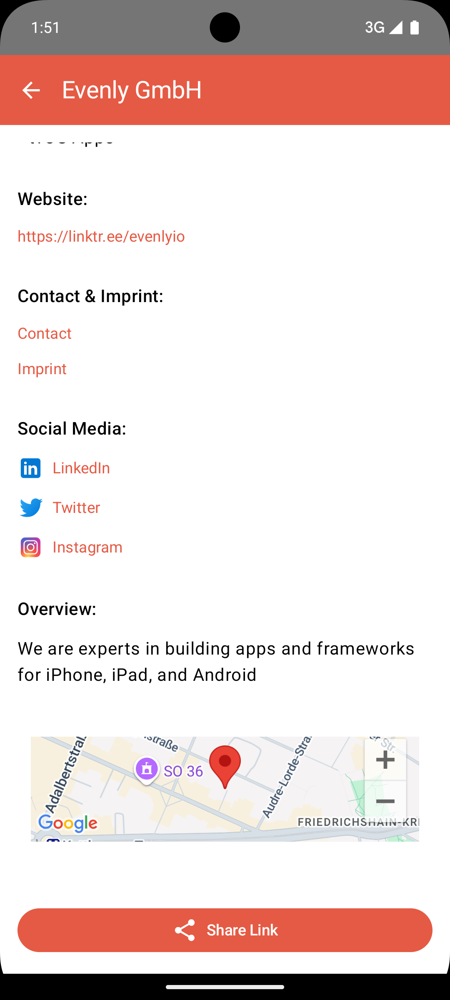

# Evenly Challenge App

This application displays **Points of Interest (POIs)** around the Evenly HQ using the **Foursquare Places API**. Users can interact with a map to view POIs, access detailed information about each location, and share links to the locations.

## How to Run the Project

Add Foursquare API and Google Maps API Tokens:
- Change these lines in local.properties:
```
  FOURSQUARE_TOKEN=YourFoursquareToken
  MAPS_API_KEY=YourGoogleMapsToken
```

- After that you can build and run the project.
---
## Screenshots

### Map Screen (POIs)

<div style="display: flex; flex-wrap: wrap;">
    <div style="margin: 10px;">
        
        <p style="text-align: center;">Map with POIs</p>
    </div>
    <div style="margin: 10px;">
        
        <p style="text-align: center;">POI Dialog</p>
    </div>
    <div style="margin: 10px;">
        
        <p style="text-align: center;">Share view appears</p>
    </div>
</div>

### Details screen

<div style="display: flex; flex-wrap: wrap;">
    <div style="margin: 10px;">
        
        <p style="text-align: center;">POI detail Screen</p>
    </div>
    <div style="margin: 10px;">
        
        <p style="text-align: center;">Share view appears</p>
    </div>
</div>

### Personalised Screen for Evenly HQ

<div style="display: flex; flex-wrap: wrap;">
    <div style="margin: 10px;">
        
        <p style="text-align: center;">Top part</p>
    </div>
    <div style="margin: 10px;">
        
        <p style="text-align: center;">Bottom part</p>
    </div>
</div>


## Features

- **POI Listing**: Fetches and displays nearby places using the Foursquare API.
- **Map Integration**: Google Maps integration for showing POI markers and Evenly HQ.
- **Detail Screen**: Detailed information about POIs, including:
    - Address
    - Distance from HQ
    - Categories with icons
    - External links
- **Sharing**: Share POI links easily with others.
- **Theming & UI**: UI built with **Jetpack Compose** and Material Design 3.

---

## Future Improvements (If I Had More Time)

- **Offline Support**: Add caching with **Room** database to support offline functionality.
- **Filtering & Search**: Allow users to filter POIs by category or search for specific locations.
- **Error Handling**: Add retry mechanisms, network status indicators, and user-friendly error messages.
- **Dark Mode**: Enhance UI/UX by supporting dark mode.

---

## Libraries Used
- Kotlin for Coroutines	Asynchronous programming
- Jetpack Compose for UI building and theming
- Dagger Hilt for Dependency injection
- Retrofit for Networking
  - Moshi for JSON serialization
  - OkHttp for HTTP client
- Google Maps Compose for Map integration
- Coil for Image loading